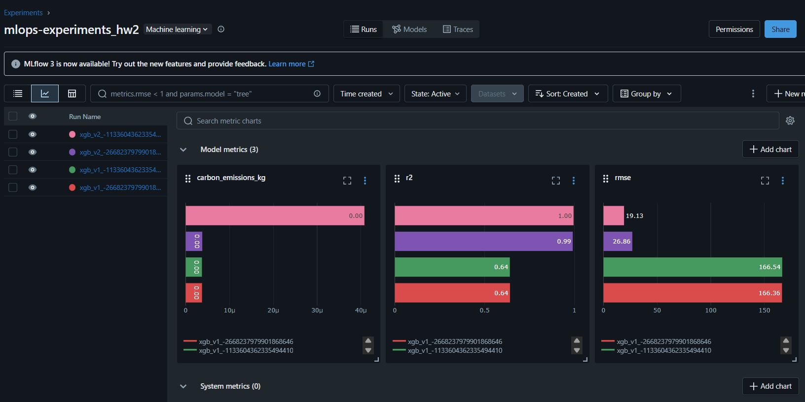
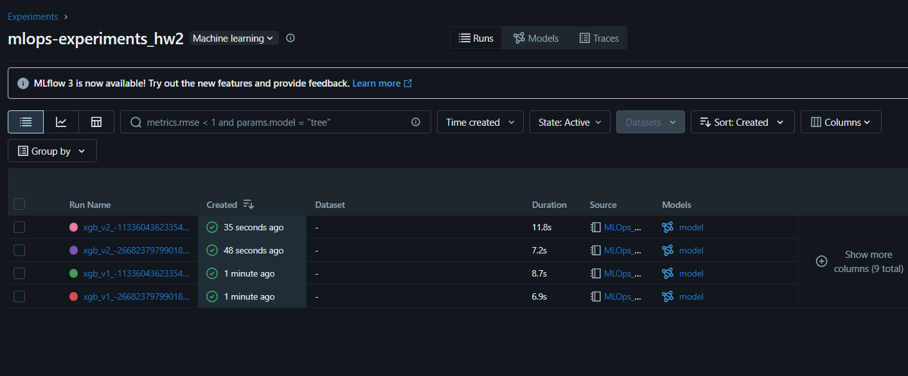

# MLOps Assignment 2: Feature Stores & ML Pipelines

## Objective
The goal of this assignment is to get familiar with using feature stores and building machine learning pipelines. The project was implemented in **Databricks** to leverage its MLOps platform capabilities. The task involves creating multiple feature versions, training models with different hyperparameters, and analyzing the results both quantitatively and qualitatively, including carbon emissions impact.

**Disclaimer:** ChatGPT was used to assist with the development of the ML pipeline and feature store creation.

---

## Project Description
This project focuses on designing a Feature Store integrated with a Machine Learning pipeline, using the dataset `athletes.csv`. The main tasks are:

- Setup an ML pipeline in a chosen MLOps platform.
- Use a feature store within the ML pipeline.
- Create two different feature versions from the dataset.
- Train the same algorithm (XGBoost regressor) using:
  - Two feature versions.
  - Two different hyperparameter sets.
- Run experiments for all 4 combinations.
- Compare the results quantitatively (metrics such as RMSE, R², and CO₂ emissions) and qualitatively (feature importances using SHAP plots).

---

## Model

- **Algorithm:** XGBoost Regressor
- **Target Variable:** `total lift`
- **Hyperparameter Sets:**
  - Set 1: `n_estimators=100`, `max_depth=3`, `learning_rate=0.1`
  - Set 2: `n_estimators=200`, `max_depth=5`, `learning_rate=0.05`

---

## Dataset Versions

### Version 1
- Columns:
  - `gender`, `age`, `height`, `weight`, `athletes_id`, `total_lift`
- Description: Original cleaned feature set without additional engineered or enhanced features.

### Version 2
- Columns:
  - All columns from Version 1, plus: `BMI`, `candj_rel`, `snatch_rel`, `deadlift_rel`, `backsq_rel`.
- Description: Enhanced feature set with additional attributes (BMI and relative lifts) that can improve the model’s predictive power.

---

## Experimental Results

| Version | n_estimators | max_depth | learning_rate | RMSE       | R²       | CO₂ Emissions (kg) |
|---------|--------------|-----------|---------------|------------|----------|--------------------|
| v1      | 100          | 3         | 0.10          | 166.358852 | 0.641063 | 0.000004           |
| v1      | 200          | 5         | 0.05          | 166.543782 | 0.640264 | 0.000004           |
| v2      | 100          | 3         | 0.10          | 26.858388  | 0.990592 | 0.000004           |
| v2      | 200          | 5         | 0.05          | 19.128123  | 0.995228 | 0.000041           |

---
## 🔍 Quantitative & Qualitative Analysis

- **Best Model:** Data Version 2 with `n_estimators=200`, `max_depth=5`, `learning_rate=0.05`  
  ➤ RMSE: **19.13**, R²: **0.995**, CO₂: **0.000041 kg**

Version 2 outperformed version 1 across all metrics, showing significantly lower RMSE and higher R² due to the inclusion of additional features. SHAP plots reveal that while gender ("female") was most important in version 1, "weight" became the dominant predictor in version 2, indicating a shift toward more meaningful physical attributes with the richer feature set.

---